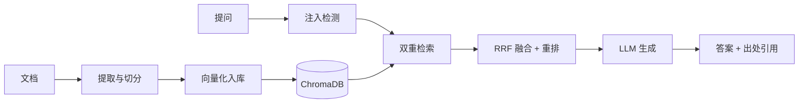

# 企业级 RAG 知识库问答系统

面向企业知识库的检索增强生成（RAG）问答服务：多格式文档入库、向量与关键词双重检索、
四级密级权限过滤，具备答案缓存、多级降级、链路可观测性，以及完整的运维能力
（健康检查分层 / 优雅关闭 / 接口限流 / 数据库迁移）。

> 当前语料以 **STM32F103 中文数据手册（62 页）** 作为真实样本验证。入库与检索链路
> 不绑定具体领域 —— 换成企业制度、产品手册、技术规范同样适用，文档格式与密级
> 规则均由配置驱动。

## 关键指标

| 指标 | 数值 | 说明 |
|---|---|---|
| 检索延迟 | **P50 74ms / P90 90ms** | 库内 661 片段，CPU 向量化 |
| 端到端延迟 | P50 813ms / P90 1341ms | 其中生成占 93%，取决于外部 LLM API |
| 答案缓存命中 | ~17ms | 相比未命中（约 2s）提升约两个数量级 |
| 自动化测试 | **231 用例全绿** | 接入 CI，含覆盖率门禁 |
| 代码规模 | 6800+ 行 / 43 模块 | 不含测试与脚本 |

> 性能数据为串行 16 次请求的实测结果，环境为本地 CPU（无 GPU）+ 外部 LLM API。
> 复现方式见下文「性能测试」。

## 功能

- **多格式入库**：PDF / Word / Markdown / TXT，由 ReaderFactory 按扩展名自动分发
- **双重检索**：向量检索（语义）+ BM25（关键词），经 RRF 融合后重排
- **四级密级**：public / internal / confidential / secret，过滤下沉至检索层
- **鉴权**：登录签发 token，密级由服务端决定，客户端不可篡改
- **多级降级**：LLM 主模型 → 备用模型 → 原文片段 → 兜底规则
- **答案缓存**：Redis（L2）+ 进程内（L1），Redis 不可用时自动降级
- **提示词注入防护**：提问侧检测 + 防诱导套话
- **可观测性**：结构化日志、Prometheus 指标、查询日志（含分阶段耗时）、反馈闭环
- **运维能力**：健康检查分层（liveness / readiness）、优雅关闭（释放模型与连接池）、
  接口限流（429 + Retry-After）、Alembic 数据库迁移
- **前端**：单文件 SPA（无构建工具），含问答、文档库、入库、日志、反馈、接口文档

## 架构



代码按四层组织，跨层接口由 `app/contracts.py` 统一约定，检索层不感知文档来源：

| 目录 | 职责 |
|---|---|
| `app/ingest/` | 多格式 Reader、密级解析、切分 |
| `app/index/` | 向量化（bge）、ChromaDB 读写 |
| `app/retrieve/` | 双重检索、RRF 融合、重排、查询理解 |
| `app/generate/` | LLM 客户端（主备降级）、兜底规则、注入检测 |
| `app/access/` | FastAPI 路由、中间件、应用装配 |
| `app/cross/` | 缓存、安全、指标、日志、请求上下文、异常 |
| `app/db/` | SQLAlchemy 模型与 CRUD |
| `config/` | 分层配置（pydantic-settings），支持 `.env` 覆盖 |

## 快速开始

**环境要求**：Python 3.11（与 CI / 容器一致）

```bash
# 1) 安装依赖
pip install -r requirements.txt -r requirements-dev.txt
# 若在 Linux 上部署，建议先装 CPU 版 torch 以免拉取 1.5GB+ 的 CUDA 依赖：
#   pip install torch --index-url https://download.pytorch.org/whl/cpu

# 2) 配置
cp .env.example .env
# 必填 LLM_API_KEY；base_url 与 model 需与 key 属同一厂商，否则会 401

# 3) 初始化账号（幂等）
python scripts/init_users.py

# 4) 灌入示例数据（STM32 手册，620 片段）
python scripts/ingest_docs.py data/raw_docs/STM32F103/STM32F103C8T6_中文数据手册.pdf

# 5) 启动
python main.py
```

访问 <http://localhost:8000/> 打开前端；`/docs` 为自动生成的 API 文档。
默认账号见 `scripts/init_users.py`。

### Docker

```bash
docker compose up -d      # 启动 redis + web + worker 三个服务
```

### 常用脚本

| 脚本 | 用途 |
|---|---|
| `scripts/ingest_docs.py` | 同步入库（不依赖 Celery/Redis），支持目录与文件名密级解析 |
| `scripts/perf_test.py` | 性能测试，输出端到端与分阶段延迟统计 |
| `scripts/test_connectivity.py` | 前后端连接冒烟验收（26 项） |
| `scripts/init_users.py` | 初始化测试账号 |

## 核心设计取舍

**融合前必须归一化。** RRF 的 `1/(k+rank)` 与 BM25 原始分是两种完全不同的尺度
（实测相差两个数量级）。直接加权相乘会让 BM25 单方面主导排序，因此融合前统一
做 min-max 归一。这条有专门的回归测试守着（把 BM25 分数整体 ×10，排序必须不变）。

**密级过滤下沉到检索层，而不是在结果返回时过滤。** 前者保证越权内容根本不参与
排序；后者会让高密级内容挤占 top-k 名额，导致低权限用户看到"检索质量变差"。

**降级必须是显式的，不能靠猜。** 早期实现用 `"相关资料如下：" in answer` 反推
是否降级 —— 一旦兜底文案改动或模型恰好也输出这句话，判断立即失效。现在由生成
流程显式返回 `degraded` 与 `degrade_reason`（区分"调用失败"与"返回空内容"，
因为两者的排查方向完全不同）。

**耗时拆解比总耗时更有价值。** 只报端到端延迟无法判断瓶颈在本地还是外部依赖。
拆出 `retrieval_ms` / `generate_ms` 后可以直接看出：检索约 76ms，生成约 1.1s，
优化重心一目了然。

## 测试与 CI

```
pytest tests/ -q --cov=app --cov=config --cov-fail-under=55
```

GitHub Actions 在每次 push / PR 时执行：`ruff` 静态检查 → 测试 → 覆盖率门禁
→ **Docker 镜像构建验证**（并断言镜像内 torch 为 CPU 版，防止依赖被静默换回
CUDA 版导致镜像膨胀 1.5GB）。

CI 中沉淀的经验（本地 Windows 无法复现，均已在 CI 首次运行时暴露）：
CUDA torch 依赖、测试夹具硬编码 Windows 字体路径、pypdf 在部分中文字体上
产生的 NUL 错位文本，以及 `pip --prefix` 导致已装包不被识别的问题。

## 性能测试

```bash
python main.py                    # 另开终端
python scripts/perf_test.py 16    # 串行 16 次，轮流使用 8 个不同问题
```

脚本会轮流使用不同问题以避开答案缓存，并分别统计端到端 / 检索段 / 生成段。

实测结果（本地 CPU + 外部 LLM，库内 661 片段）：

```
端到端   p50= 813ms  p90=1341ms
检索段   p50=  74ms  p90=  90ms     ← 本地完成，稳定
生成段   p50=1226ms  p90=1269ms     ← 外部 LLM API，非本地可优化
缓存命中 ~17ms（未命中约 2086ms）
```

> 服务启动时会对**完整检索链路**做一次预热。此前预热用的是一句会命中兜底规则的
> 问候语，根本没进检索链路，导致首个真实请求的检索段耗时高达 5.8s；修正后
> 首次请求的检索段即为正常水平（74ms）。

## 运维

```bash
# 健康检查
curl localhost:8000/health/live     # 进程是否存活（不检查任何依赖）
curl localhost:8000/health/ready    # 能否接流量（依赖不可用返回 503）
curl localhost:8000/health          # 综合明细，始终 200，供人工排查

# 数据库迁移
alembic upgrade head                        # 新环境：从零建表
alembic stamp head                          # 已有数据的库：标记基线已应用
alembic revision --autogenerate -m "描述"   # 改完模型后生成迁移
alembic check                               # 检查模型与库是否已漂移
```

限流默认 **60 次 / 分钟**（`API_RATE_LIMIT_PER_MINUTE`，设 0 关闭），按身份计数
（已登录用 uid、未登录用 IP），超限返回 `429` 并带 `Retry-After`；探活与指标端点
不参与限流。进程收到停止信号时会释放模型、向量库句柄与数据库连接池，
`docker-compose.yml` 中已配 `stop_grace_period: 30s` 留出这段时间。

## 已知边界

诚实说明当前尚未完成 / 有意未做的部分：

- **测试覆盖 60%**：`access/routes.py` 等模块仍偏低，未覆盖的主要是需要重依赖
  （ChromaDB / 模型）的分支
- **前端无自动化测试**：934 行的单文件 SPA 目前靠人工与连接冒烟脚本验证
- **Redis 为可选依赖**：未启动时答案缓存自动降级为进程内 L1，功能可用但重启即失效
- **限流为单进程内存实现**：多副本部署需改为 Redis 计数，否则实际配额会被放大到
  「副本数 × 阈值」
- **Docker 镜像构建仅在 CI 验证**：本地开发机未安装 Docker，未做镜像体积实测

## 目录结构

```
app/            应用代码（ingest / index / retrieve / generate / access / cross / db）
config/         分层配置
tests/          自动化测试（212 用例）
scripts/        运维与验证脚本（其余一次性脚本归档于 scripts/legacy/）
static/         前端（单文件 SPA）
data/           运行时数据：chroma_db / models / raw_docs（样本手册）
main.py         启动入口（配置校验 → 初始化 → 预热 → uvicorn）
```
